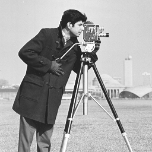
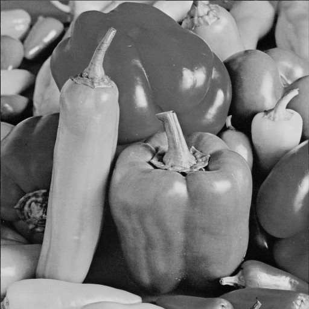
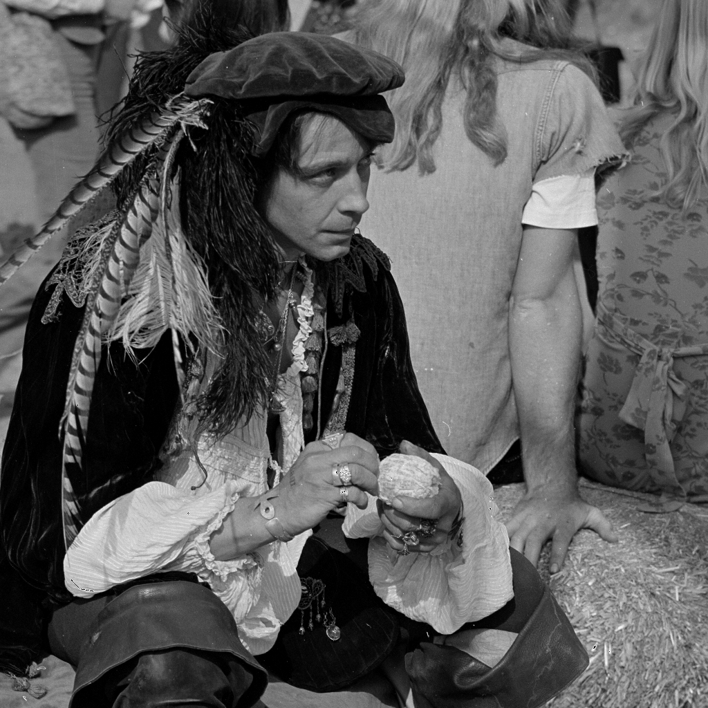
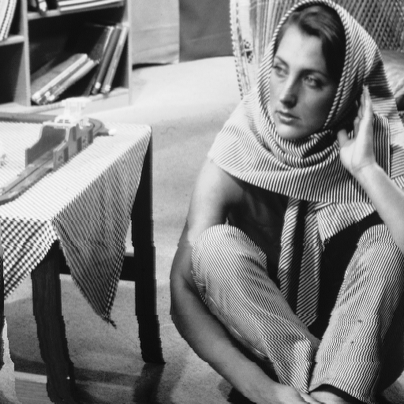

# Poročilo: Implementacija FLoCIC kompresije sivinskih BMP slik

**Avtor:** Matic Majerič
**Datum:** 3. januar 2026

---

## 1. Uvod

V okviru projektne naloge sem implementiral algoritem FLoCIC za kompresijo in dekompresijo sivinskih BMP slik. Algoritem temelji na JPEG-LS napovedi vrednosti, prepletanju napovenih vrednosti in interpolativnem kodiranju.

---

## 2. Rezultati testiranja

Testiranje je bilo izvedeno na 10 različnih sivinskih BMP slikah. Spodnja tabela prikazuje rezultate kompresije in dekompresije.

| # | Datoteka | Velikost original | Velikost stisnjena | Razmerje (orig./stisn.) | Čas kompresije (s) | Čas dekompresije (s) |
|---|----------|-------------------|--------------------|-------------------------|---------------------|----------------------|
| 1 | Man.bmp | 1.00 MB | 712.89 KB | 1.438 | 3.5950 | 3.3660 |
| 2 | Barb.bmp | 406.05 KB | 285.64 KB | 1.422 | 1.4396 | 1.3257 |
| 3 | Lena.bmp | 257.05 KB | 155.92 KB | 1.649 | 0.8163 | 0.7654 |
| 4 | Barbara.bmp | 257.05 KB | 191.44 KB | 1.343 | 0.9898 | 0.9052 |
| 5 | Baboon.bmp | 257.05 KB | 219.86 KB | 1.169 | 1.0422 | 0.9380 |
| 6 | Cameraman.bmp | 65.05 KB | 44.09 KB | 1.475 | 0.2222 | 0.1972 |
| 7 | Peppers.bmp | 257.05 KB | 180.81 KB | 1.422 | 0.9729 | 0.8863 |
| 8 | Bridge.bmp | 257.05 KB | 197.33 KB | 1.303 | 0.9651 | 0.8951 |
| 9 | boat 512x512.bmp | 257.05 KB | 184.27 KB | 1.395 | 0.9319 | 0.8505 |
| 10 | Earth.bmp | 257.05 KB | 178.70 KB | 1.438 | 1.0205 | 0.8384 |

**Skupaj:** Original = 3.22 MB, Stisnjeno = 2.30 MB
**Povprečno razmerje:** 1.402

---

## 3. Analiza rezultatov

### 3.1 Kompresijsko razmerje

Implementacija je dosegla povprečno kompresijsko razmerje **1.402:1**, kar pomeni, da so bile slike v povprečju zmanjšane na približno 71% njihove prvotne velikosti.

Najboljše kompresijsko razmerje je bilo doseženo pri sliki **Lena.bmp** (1.649:1), najslabše pa pri sliki **Baboon.bmp** (1.169:1). Razlike v kompresijskih razmerjih so posledica različne kompleksnosti in entropije posameznih slik. Slike z več detajli in višjo entropijo (kot je Baboon) se težje kompresirajo, medtem ko se gladke slike z manj detajli (kot je Lena) bolje kompresirajo.

### 3.2 Čas izvajanja

Čas kompresije in dekompresije je odvisen predvsem od velikosti slike. Večje slike, kot je Man.bmp (1024×1024 pikslov), zahtevajo daljši čas obdelave (približno 3.6 sekund za kompresijo), medtem ko manjše slike, kot je Cameraman.bmp (256×256 pikslov), se obdelajo zelo hitro (približno 0.2 sekundi za kompresijo).

Čas dekompresije je primerljiv s časom kompresije, kar kaže na uravnoteženo implementacijo algoritma.

### 3.3 Brezizgubna kompresija

Implementacija uporablja **brezizgubno (lossless) kompresijo**, kar pomeni, da je dekompresirana slika **popolnoma identična** originalni sliki. Vsak piksel dekompresirane slike ima natanko enako vrednost kot ustrezen piksel v originalni sliki. To je bilo preverjeno s primerjavo vseh pikslov med originalno in dekompresirano sliko.

---

## 4. Zaslonski posnetki dekompresiranih slik

Spodaj je prikazanih 5 zaslonskih posnetkov uspešno dekompresiranih slik. Vse dekompresirane slike so popolnoma identične originalnim slikam (brezizgubna kompresija).

### 4.1 Lena.bmp

### 4.2 Cameraman.bmp

### 4.3 Peppers.bmp

### 4.4 Man.bmp

### 4.5 Barbara.bmp

---

## 5. Zaključek

Implementacija algoritma FLoCIC je bila uspešna. Algoritem pravilno kompresira in dekompresira sivinske BMP slike **brez izgube podatkov** (lossless kompresija). Dekompresirana slika je **popolnoma identična** originalni sliki, kar je bilo preverjeno s pixel-by-pixel primerjavo.

Algoritem temelji na:

- **JPEG-LS** napovedi vrednosti pikslov
- **Prepletanju** (interleaving) napovenih vrednosti
- **Interpolativnem kodiranju** za binarni zapis

Implementacija v programskem jeziku Python omogoča enostavno uporabo in testiranje algoritma na poljubnih sivinskih BMP slikah. Povprečno kompresijsko razmerje 1.402:1 predstavlja razumno zmanjšanje velikosti datotek ob ohranitvi popolne kakovosti slike.

---

**Konec poročila**
