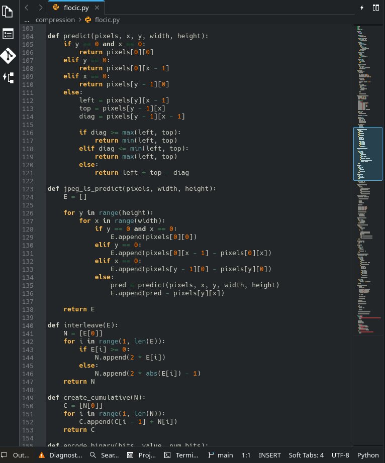
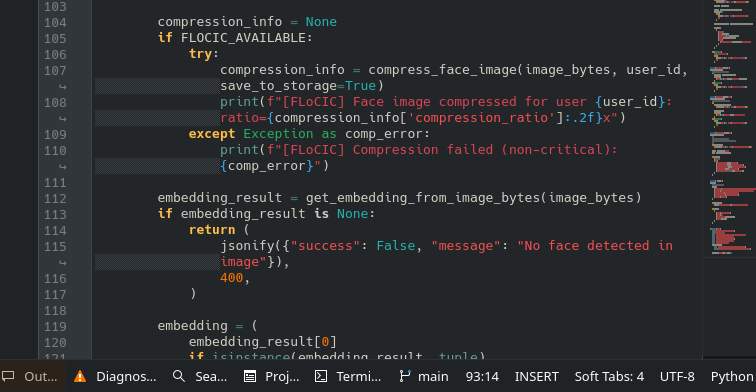
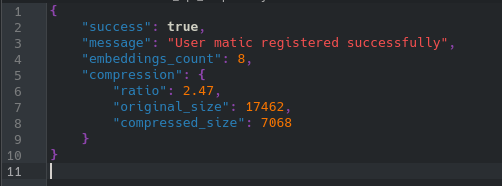
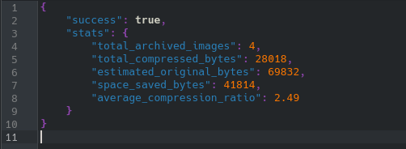
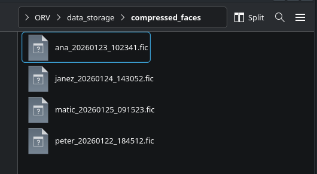

# FLoCIC Algoritem

:::::::::::::: {.columns}
::: {.column width="50%"}
- **Brezizgubna** kompresija sivinskih slik
- JPEG-LS MED prediktor
- Interpolativno kodiranje
- Pretvorba napak v kumulativne vrednosti
:::
::: {.column width="50%"}

:::
::::::::::::::

# Integracija v projekt

:::::::::::::: {.columns}
::: {.column width="50%"}
- Modul `compression/` v projektu
- Avtomatska kompresija ob registraciji
- Arhiviranje slik obrazov (.fic format)
- Povezava z Face Recognition API
:::
::: {.column width="50%"}

:::
::::::::::::::

# Implementacija

:::::::::::::: {.columns}
::: {.column width="50%"}
- Slika → sivinska 128x128
- Kompresija z FLoCIC
- Shranjevanje v `data_storage/`
- API vrne podatke o kompresiji
:::
::: {.column width="50%"}

:::
::::::::::::::

# Shramba kompresiranih slik

:::::::::::::: {.columns}
::: {.column width="50%"}
- Format: `{user}_{timestamp}.fic`
- Lokacija: `compressed_faces/`
- Endpoint za statistiko
- Možnost dekompresije
:::
::: {.column width="50%"}

:::
::::::::::::::

# Rezultati

:::::::::::::: {.columns}
::: {.column width="50%"}
- **Razmerje:** ~2.5x kompresija
- **Prihranek:** ~60% prostora
- **Brezizgubno:** originalna kvaliteta
- **Avtomatizirano:** ob vsaki registraciji
:::
::: {.column width="50%"}

:::
::::::::::::::
